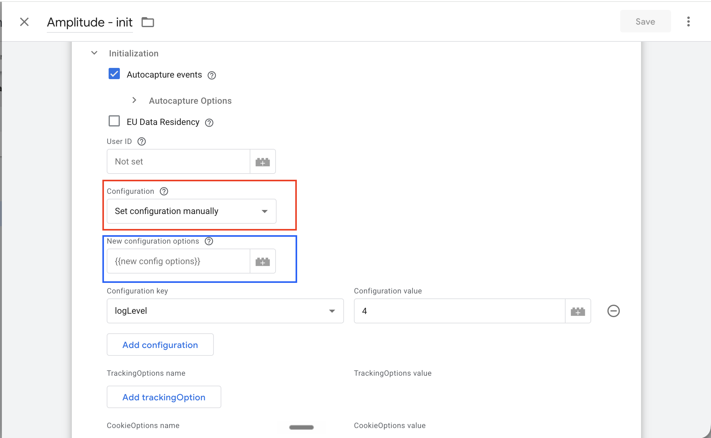

# Configuration in the `init` tag

The `Amplitude - init` tag has **two** fields for passing SDK configuration. They look
similar but behave very differently. This doc explains the difference.



| Field | `data` key | Role |
|---|---|---|
| 🔴 **Configuration** | `data.initOptions` | The **base** config object the tag starts from. |
| 🔵 **New configuration options** | `data.initOptionsMore` | A config object **merged on top, last**. |

## How the config is built

In `generateConfiguration(data)` (`template.tpl`) the order is:

1. **Base** — start from the 🔴 Configuration field (`template.tpl:1515`).
   This is either the manual key/value table, the GTM variable you picked, or `{}`.
2. **UI settings layered on top** (`template.tpl:1518`–`1735`) — the tag mutates the base
   object with the checkboxes/fields: `autocapture`, `sessionReplay`, `guidesSurveys`,
   `customEnrichment`, `trackingOptions`, etc. **These overwrite matching keys in the base.**
3. **Merge the 🔵 field last** (`template.tpl:1737`):
   ```js
   const mergedOptions = mergeObject(initOptions, data.initOptionsMore);
   ```
   `mergeObject` (`template.tpl:1431`) is a **shallow, top-level** overwrite — the 🔵 field
   wins on any conflicting top-level key.

Key takeaways:

- 🔴 is the **starting point**, then the UI overwrites parts of it.
- 🔵 is applied **last** and **wins** for any overlapping **top-level** key.
- The merge is **shallow** — a top-level key like `autocapture` is **replaced wholesale**,
  not deep-merged.

## Example

Assume **Autocapture events is checked** in the UI (so the tag builds its own
`autocapture` object), and you pass this same variable to each field:

```js
{
  deviceId: 'my-device-id',
  autocapture: {
    attribution: {
      trackingMethod: ['userProperty', 'eventProperty']
    },
    newAutocaptureOption: value
  }
}
```

### Assigned to 🔴 Configuration (`data.initOptions`)

The variable becomes the **base**. The UI's autocapture block then runs and
**overwrites** the whole `autocapture` key — so both `attribution.trackingMethod` and
`newAutocaptureOption` are **lost**. The top-level `deviceId` is untouched and survives.

```js
{
  deviceId: 'my-device-id',              // ✅ kept (UI never touches it)
  autocapture: { /* UI autocapture */ }, // ❌ entire object overwritten —
                                         //    attribution + newAutocaptureOption lost
  customEnrichment: false,
  sessionReplay: false,
  guidesSurveys: false
}
```

> If Autocapture is **unchecked**, the tag sets `autocapture: false`, still wiping your value.

### Assigned to 🔵 New configuration options (`data.initOptionsMore`)

The variable is **merged last**. `deviceId` is added, and because the merge is shallow,
your `autocapture` **replaces** the UI's autocapture object entirely.

```js
{
  // ...everything the UI built...
  customEnrichment: false,
  sessionReplay: false,
  guidesSurveys: false,
  deviceId: 'my-device-id',              // ✅ added
  autocapture: {                         // ✅ your value wins, but it REPLACES
    attribution: {                       //    the UI autocapture (shallow merge)
      trackingMethod: ['userProperty', 'eventProperty']
    },
    newAutocaptureOption: value
  }
}
```

### Side-by-side

| Your value | 🔴 Configuration | 🔵 New configuration options |
|---|---|---|
| top-level `deviceId` | ✅ kept | ✅ kept |
| nested `autocapture.*` (`attribution`, `newAutocaptureOption`) | ❌ overwritten by UI autocapture | ✅ kept, but **replaces** the entire UI `autocapture` |

**Rule of thumb:** use 🔵 **New configuration options** when you want your value to win.
Just remember it overwrites a whole top-level key (no deep merge), so include the full
object for keys like `autocapture`.

> Tip: set `logLevel: 4` and the tag logs both the pre-merge and merged config
> (`template.tpl:1739`–`1741`).
